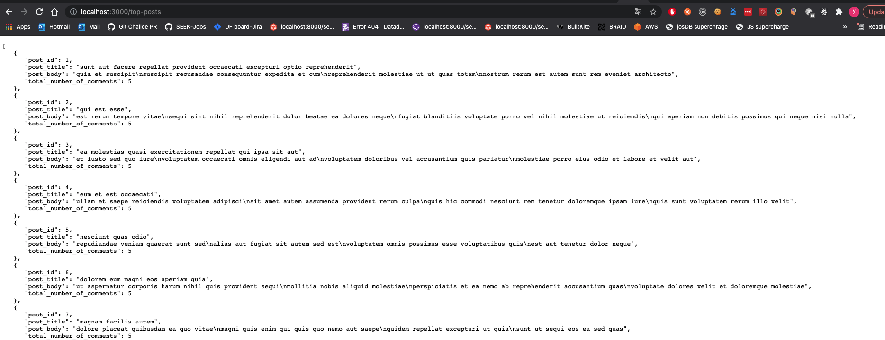

# tribehired-devs-exercise

## How to start

`yarn`

`yarn start`

## Routes
    - Get all comments: http://localhost:3000/comments
    - Search comment with fields: http://localhost:3000/comments?postId=60&name=hic%20eum%20sed&email=Nikita@garfield.biz
    - Get all posts: http://localhost:3000/posts
    - Get top posts: http://localhost:3000/top-posts

## Screenshot for questions
1. Return a list of Top Posts ordered by their number of Comments. 

2. Search API 

